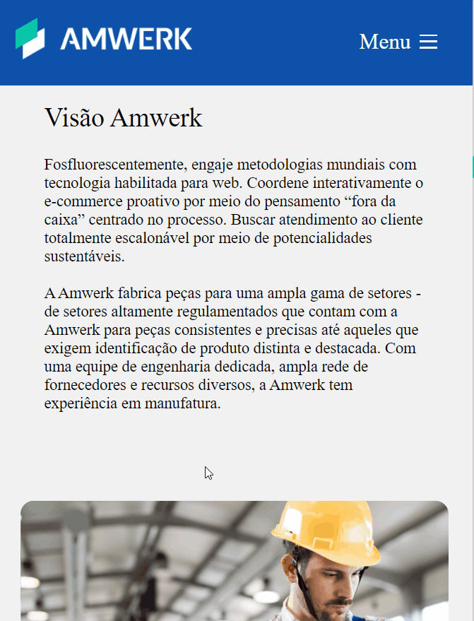

# Example Web02
[](https://github.com/Mascimo/Example-Web02/blob/main/LICENSE) 

Projeto: https://mascimo.github.io/Example-Web02/

# Sobre o projeto

Example Web é uma aplicação front end web e mobile construída durante o 2ª modulo do curso **Desenvolvimento Web**.

A aplicação consiste em uma página empresarial, onde são mostrados seus produtos e serviços, utilizando recursos de animação para melhorar a usabilidade.


## Layout mobile
</img>

## Layout web
</img>
<br><br><br><br><br><br>
</img>

# Tecnologias utilizadas
## Back end
- JS
## Front end
- HTML
- CSS
- JS

# Como executar o projeto

## Front end
Pré-requisitos: npm / yarn

```bash
# clonar repositório
git clone https://github.com/Mascimo/Example-Web02

# entrar na pasta do projeto front end web
cd front-web

# instalar dependências
yarn install

# executar o projeto
yarn start
```

# Autor

Pedro Henrique Mascimo

https://www.linkedin.com/in/pedro-henrique-78a204135/
